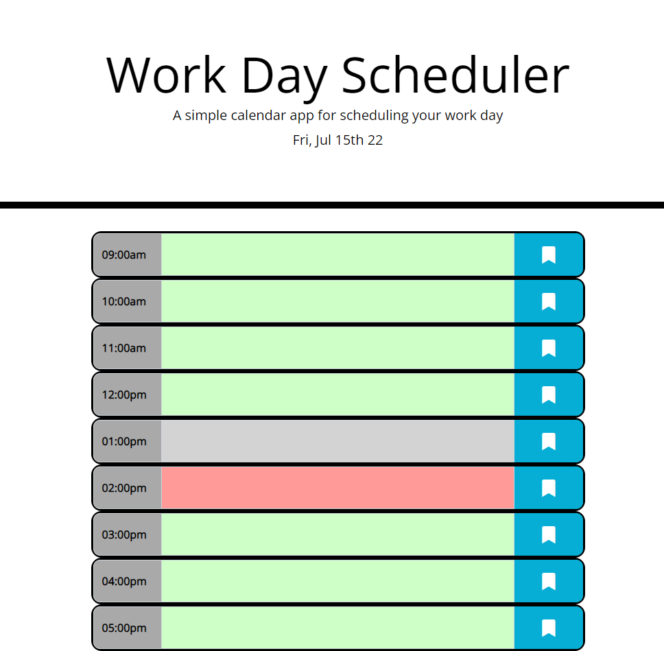

## Work Day Schedule

This code was built on top of the bootcamp starter code for Module 5 Challenge: Third-Party APIs Challenge: Work Day Scheduler

Click [here](https://jorgegarit.github.io/work-day-scheduler/) to view the Work Day Scheduler

### Header

the header includes the main title of the page "Work Day Scheduler", a bried description of what the page is for, and then the current Day and Date. 

### Container for Scheduler 

The cointainer contains (pun intended) multiple rows with a specified time in a rnage of one hour per row. It also includes the text area where users can input whatever they need to schedule. Finally it includes and icon of bookmark that when click triggers the even to save the input text into the localStorage. 

In addition the text area will chaneg in color in relation to the current time. Light read means the current time is within the hour determined by the row, light green is for future time that has not elapsed yet and light grey if for time that has already occured that day. 

#### Best Wishes 🤓
